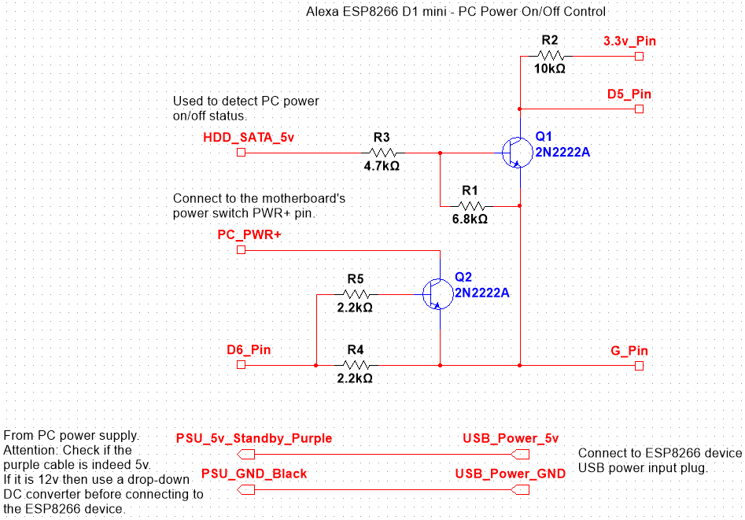
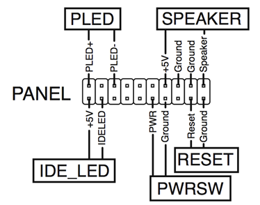

# Alexa PC power on/off remote control using an ESP8266 device

Issue PC turn on and off (shut down) commands via Alexa.

Requires an [ESP8266 Wemos D1 Mini](https://www.ebay.co.uk/itm/203579081685) device and the minimal circuit below, which allows the ESP8266 to interface with the power on/off switch of the motherboard plus detect the PC power on or off state via a spare SATA +5v power supply cable.

## Connections between schematic and PC
**HDD_SATA_5v** - To a free SATA power +5v cable. Used to detect PC power on or off state. 

**PC_PWR+** - To the motherboard header's power on/off switch pin PWR (+). The power on/off switch consists of 2 pins, one of which is a ground pin and the other a +3v voltage pin. Grounding the PWR (+) pin for a short period of time sends the on or off command to the motherboard.

**G_Pin** - To the ESP8266 ground pin.

**3.3v_Pin** - To the ESP8266 3.3v pin.

**D5_Pin** - To the ESP8266 D5 pin.

**D6_Pin** - To the ESP8266 D6 pin.

## DC power supply harness to the ESP8266 device from the PC PSU
**PSU_5v_Standby_Purple** - To the power supply unit's +5v permanent (standby) voltage. Purple cable. Check for correct voltage. **ATTENTION:** Depending on your PSU, this may actually be +12v output instead of +5v. In that case you will need to use a step-down DC voltage converter such as [this one](https://www.ebay.com/itm/231914348146).

**PSU_GND_Black** - The power supply unit's ground. Any black cable coming out from the same harness as the purple cable above.

**USB_Power_5v** - To the ESP8266 USB power input. You will need to buy a micro USB male connector to connect this.

**USB_Power_GND** - To the ESP8266 USB ground. Connected using the micro USB connector from above.